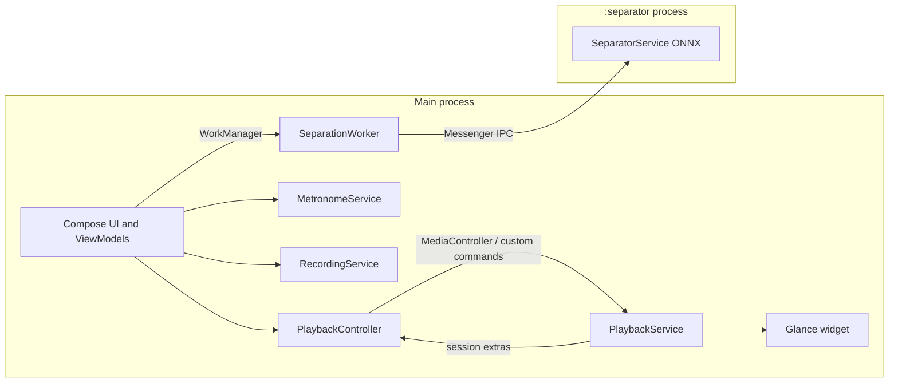

# Architecture

> Last updated: 2026-10-06

## Modules

Defined in [`settings.gradle.kts`](../settings.gradle.kts).

| Module | Type | Purpose |
|---|---|---|
| `:app` | Application `com.autoomstudio.mplay` | The player. Everything user-facing. |
| `:separation` | Android library | DSP (STFT, FFT, resampling) and the ONNX Runtime HT-Demucs pipeline. Has its own unit tests. Only `:app` uses it. |
| `:spike` | Application `com.autoomstudio.mplay.ai.spike` | Throwaway feasibility app for benchmarking separation on devices. Not shipped. |

Other top-level folders: `models/` (the `htdemucs.onnx` model, gitignored, plus its committed `.sha256`), `tools/` (Python scripts to export the model and generate DSP test references), `logos/`, `mockup-design/`.

## Build

[`app/build.gradle.kts`](../app/build.gradle.kts), versions in [`gradle/libs.versions.toml`](../gradle/libs.versions.toml).

- `compileSdk 37`, `minSdk 26`, `targetSdk 37`, Java 17, Compose, KSP, Room Gradle plugin (schemas exported to `app/schemas/`).
- `BuildConfig.MODEL_SHA256` comes from `models/htdemucs.onnx.sha256`. `BuildConfig.SEPARATION_ABIS` is `arm64-v8a,x86_64` in debug and `arm64-v8a` in release.
- Release signing reads an uncommitted `keystore.properties`. Release enables R8 optimisation.
- `androidResources.noCompress += "onnx"` so the model can be memory-mapped from the APK.
- ONNX Runtime native libraries are stripped for every ABI outside `SEPARATION_ABIS`.
- Custom tasks:
  - `prepare<Variant>ModelAssets` (`PrepareModelAssets`): copies and SHA-256-checks the model. Release fails without it; debug only warns.
  - `check<Variant>NoInternet` (`CheckNoInternetPermission`): fails `assemble`/`bundle` if `android.permission.INTERNET` appears in the merged manifest.

Key libraries: Compose BOM 2026.09.00, Material 3, Media3 1.11.1 (ExoPlayer, Session, Transformer), Room 2.8.5, WorkManager 2.10.1, Glance 1.2.0, DataStore 1.2.1, Coil 3, Lottie 6.7.1, Coroutines 1.11.0, ONNX Runtime Android 1.22.0 (in `:separation`).

## Dependency injection

There is no DI framework. [`di/AppContainer.kt`](../app/src/main/java/com/autoomstudio/mplay/di/AppContainer.kt) is created once in `MPlayApp.onCreate()` and exposed as `MPlayApp.container`.

- `applicationScope = CoroutineScope(SupervisorJob() + Dispatchers.Default)` is used for writes that must outlive the screen or service that started them.
- Nearly everything is a `lazy` singleton: repositories (songs, playlists, duplicates, stems), stores (session, library prefs, widget, `AppSettings`), `MPlayDatabase`, separation backend/controller, clip helpers, `songDeleter`, `tempoAnalyzer`, `metronomeController`, `recordingStore`, `singAlongSession`.
- `musicPlaying: MutableStateFlow<Boolean>` is shared state: `PlaybackService` writes it, `MetronomeController` reads it.
- A private `mainScope` (`Dispatchers.Main.immediate`) backs a private app-scoped `PlaybackController` (`restoresSession = false`) passed to `MetronomeController` as its `MusicTimeline`, for syncing with the song. It binds to `PlaybackService` only while sync is on.
- Factories: `createWidgetStatePublisher()` and `createPlaybackController(scope)` return new instances per call.

ViewModels all follow the same pattern:

```kotlin
companion object {
    val Factory = viewModelFactory {
        initializer { XViewModel((this[APPLICATION_KEY] as MPlayApp).container) }
    }
}
```

ViewModels: `LibraryViewModel`, `PlaybackViewModel`, `PlaylistsViewModel`, `SeparationViewModel`, `SettingsViewModel`, `MetronomeViewModel`, `SingAlongViewModel`, `TrimEditorViewModel`. State is exposed as `StateFlow` and collected with `collectAsStateWithLifecycle`; one-off events (snackbar messages) are `Flow`s.

## Startup

1. `MPlayApp.onCreate` builds the container. In the main process only, it calls `separationController.start()` (resumes the separation queue) and `singAlongSession.cleanUpLeftovers()`. The `:separator` process skips both.
2. `MainActivity.onCreate` keeps the splash screen until `SettingsViewModel.theme` has loaded (avoids a theme flash), then renders `MPlayAppTheme { MPlayRoot(...) }`.
3. `handleIntent` (also from `onNewIntent`; the activity is `singleTop`) turns these into one-shot UI flags:
   - `EXTRA_OPEN_NOW_PLAYING` from the media notification and widget
   - `SeparationLinks.ACTION_OPEN_QUEUE` from the separation notification
   - `EXTRA_OPEN_METRONOME` from the metronome notification
4. `MPlayRoot` requests the audio permission (shows `PermissionRationaleScreen` while denied), asks for `POST_NOTIFICATIONS` once on Android 13+, calls `LibraryViewModel.onAppForeground()` on every resume, and renders `MainScreen`.

## Navigation

No Navigation-Compose. [`ui/main/MainScreen.kt`](../app/src/main/java/com/autoomstudio/mplay/ui/main/MainScreen.kt) holds state in `rememberSaveable` and swaps screens with `AnimatedContent` + `fadeThrough()`.

- Bottom bar (`Destination`): `Library`, `Playlists`, `Metronome`, `Settings`.
- Settings sub-pages (`SettingsPage`): `Main`, `Duplicates`, `Separation` (queue), `About`, `Licenses`.
- Library back stack: route strings `album:<id>` / `artist:<name>`.
- `ExpandablePlayer` is a draggable sheet from the mini player to Now Playing.
- Overlays: `AddToPlaylistSheet`, `PlaylistNameDialog`, `DeleteSongsHost`, `SongInfoHost`, `SeparationNoticeDialog`, `ModelMissingDialog`, `SeparationProgressPill`, `SingAlongOverlay`, snackbars.
- `TrimEditorActivity` is a separate activity.
- Back handling is layered: expanded player, then selection, then current screen.

## Processes, services and background work



| Component | Kind | Foreground type | Notes |
|---|---|---|---|
| `playback.PlaybackService` | `MediaSessionService`, exported | `mediaPlayback` | Owns ExoPlayer and MediaSession. See [playback](features/playback.md). |
| `metronome.MetronomeService` | Service | `mediaPlayback` | Separate so the metronome runs while music is paused. Notification ID 4201. |
| `singalong.RecordingService` | Service | `microphone` | Only while a take is being prepared or recorded. Notification ID 4301. |
| `SeparationWorker` (via WorkManager `SystemForegroundService`) | `CoroutineWorker` | `mediaProcessing` (35+) / `dataSync` (29-34) | Notification IDs 4101/4102. |
| `separation.worker.SeparatorService` | Bound service, `:separator` process | none | Runs the model so a native crash or OOM never kills playback. |
| `MediaButtonReceiver` | Receiver, exported | | Headset/widget play-pause. |
| `widget.MPlayWidgetReceiver` | Glance receiver, exported | | Home/lock screen widget. |
| `separation.worker.CancelSeparationReceiver` | Receiver | | Cancel action on the separation notification. |
| `ui.trim.TrimEditorActivity` | Activity | | Clip / ringtone editor. |

### How the UI talks to playback

- `PlaybackViewModel` creates a `PlaybackController` (main thread only) that wraps a Media3 `MediaController` bound to `PlaybackService`. Commands issued before connection are queued.
- Standard transport goes through the `Player` API. App-specific actions use custom `SessionCommand`s from `PlaybackCommands`: `SET_SLEEP_TIMER`, `SET_SLEEP_TIMER_END_OF_SONG`, `EXTEND_SLEEP_TIMER`, `CANCEL_SLEEP_TIMER`, `SET_LOFI`, `SET_STEM_MODE`. Only MPlay's own package is granted these.
- The service reports sleep timer, lofi and stem mode back through session extras, which the controller folds into `StateFlow<NowPlayingState?>`.

## Permissions summary

From [`AndroidManifest.xml`](../app/src/main/AndroidManifest.xml):

| Permission | Used by |
|---|---|
| `READ_MEDIA_AUDIO`, `READ_EXTERNAL_STORAGE` (max 32) | Library |
| `WRITE_EXTERNAL_STORAGE` (max 29) + `requestLegacyExternalStorage` | Deleting songs and saving files on old Android |
| `POST_NOTIFICATIONS` | All notifications |
| `FOREGROUND_SERVICE`, `_MEDIA_PLAYBACK`, `_DATA_SYNC`, `_MEDIA_PROCESSING`, `_MICROPHONE` | Services listed above |
| `RECORD_AUDIO` (+ optional `android.hardware.microphone` feature) | Sing-along |
| `WAKE_LOCK` | Playback, WorkManager |
| `WRITE_SETTINGS` | Setting ringtones |
| `ACCESS_NETWORK_STATE` | Removed with `tools:node="remove"` |

## Change history

| Date | Commit | Change |
|---|---|---|
| 2026-10-02 | `5685cb3`..`3039fba` | Initial app: container, `MainActivity`, playback service, library, playlists, clips. |
| 2026-10-03 | `73cdb66` | Widget receiver and notification permission. |
| 2026-10-05 | `55e39e6`, `967eb22` | Separation: WorkManager worker, `:separation` module, `:separator` process, model build tasks. |
| 2026-10-06 | `e13b2f7` | `MetronomeService`, `RecordingService`, `RECORD_AUDIO`, `FOREGROUND_SERVICE_MICROPHONE`, `EXTRA_OPEN_METRONOME`, Metronome tab, container additions. |
| 2026-10-06 | - | App-scoped `PlaybackController` as the metronome's `MusicTimeline` (`mainScope` in `AppContainer`). |
