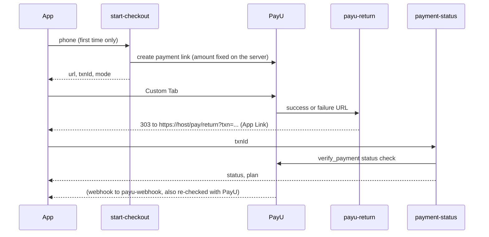

# Payments (PayU Pro subscription)

> Status: Unreleased | Added in: next version after 3.2.3 | Last updated: 2026-10-10

## Summary

Pro costs ₹99 a month and is paid through PayU Payment Links ([payments PRD](../../MP3-Studio-PRD-Payments-PayU-Payment-Link.md)). "Go Pro" asks for an Indian mobile number, opens a PayU-hosted page in a Custom Tab and, on return, waits for the server to confirm the payment with PayU. By default the link registers autopay (a standing instruction through UPI AutoPay, eNACH or card), and the server debits ₹99 each month. With the server flag `PAYU_BILLING_MODE=manual`, links are one-off and the user renews by hand. The app never talks to PayU, never holds PayU credentials and never decides Pro itself: every decision is made by the Supabase backend after a PayU status check.

## Key files

Paths are relative to `app/src/main/java/com/autoomstudio/mp3studio/` unless they start with `supabase/`, `web/` or `app/`.

| File | Role |
|---|---|
| `data/billing/BillingModels.kt` | `BillingError` (server error codes), `BillingException`, `CheckoutLink`, `PaymentState`, `PaymentSummary`, `CancelResult`, `PaymentRecord`. |
| `data/billing/BillingBackend.kt` | `SupabaseBillingBackend`: `start-checkout`, `payment-status` and `subscription` Edge Functions, and payment history from the `payments` table (own rows through RLS, newest 50). Maps HTTP errors to `BillingError`. |
| `data/billing/BillingRepository.kt` | `startCheckout`, `confirm` (polls `payment-status` until settled, then refreshes the plan), `cancel`, `history`, `clear`; `DataStorePendingPaymentStore` keeps the awaited transaction across process death. |
| `data/billing/PhoneNumber.kt` | `PhoneNumber.normalize` (accepts spaces, dashes, `+91`, `91` or a leading 0; same rule as the server) and `TxnId.parse`. |
| `data/plan/Entitlements.kt` | `SubscriptionStatus`, `AutopayStatus`, `BillingMode`, `BillingState`, `PendingPayment`, `LastPayment`, plus `hasPhone`, `billingMode` and `paymentsEnabled` on `Entitlements`. |
| `ui/plans/BillingViewModel.kt` | Checkout sheet state, opening the link, the return and resume checks, cancel autopay. |
| `ui/plans/BillingHost.kt` | Root-level host: opens links in a Custom Tab (`androidx.browser`, https only), handles returns, checks on resume, shows the sheet, result screen and cancel dialog. |
| `ui/plans/CheckoutSheet.kt` | Price, autopay or manual terms, the +91 phone field, Pay ₹99, links to Terms, Refund policy and Privacy. |
| `ui/plans/PaymentResultScreen.kt` | Full-screen result: confirming, success, failed, link expired, not completed, still processing, couldn't check, no browser. |
| `ui/plans/BillingStatus.kt` | `BillingStatusRules.of(...)`: the notice and buttons the Plans screen shows for each subscription state. |
| `ui/plans/PaymentReturnLink.kt` | Parses `https://<pay.returnHost>/pay/return?txn=...` App Links. |
| `ui/plans/PaymentHistoryScreen.kt` | Settings > Plans > Payment history, with a receipt dialog. |
| `ui/plans/PaymentText.kt` | Rupee and date formatting, error and status text. |
| `ui/admin/AdminPaymentsScreen.kt` | Admin payments list and billing health; see [admin](admin.md). |
| `supabase/functions/start-checkout/`, `payment-status/`, `payu-webhook/`, `payu-return/`, `subscription/`, `billing-jobs/` | Billing Edge Functions; see [backend](../backend.md#billing-payu). |
| `supabase/functions/_shared/payu.ts`, `billing.ts`, `checkout.ts`, `webhook.ts`, `jobs.ts`, `notifier.ts` | PayU client (OAuth Payment Links API and SHA-512-signed `postservice.php` commands), shared flows, request parsing, webhook classification and redaction, job auth, billing notices. |
| `supabase/migrations/20261013000000_payu_billing.sql` to `20261015000000_billing_admin.sql` | Schema, verification, scheduled jobs and admin billing. |
| `web/pay/return/index.html`, `web/.well-known/assetlinks.json` | The App Link page with an "Open MP3 Studio" fallback, and the Digital Asset Links template. |

## How it works

### Checkout

- Go Pro (Plans screen or upgrade sheet), Fix payment, Set up autopay and Renew all open `CheckoutSheet` (`CheckoutPurpose`). The phone field shows only while `Entitlements.hasPhone` is false; the server stores the number in `profiles.phone` on the first checkout.
- `start-checkout` calls `begin_checkout()`, which refuses with `phone_required`, `invalid_phone`, `payment_in_progress` (an open link exists), `already_subscribed` or `mandate_update_pending`, and rate-limits attempts. A "replace" checkout while Pro is active is allowed only when autopay isn't `on` (or, in manual mode, within 7 days of expiry).
- The app saves `(userId, txnId)` in DataStore before opening the link, then opens it in a Custom Tab (any browser if Custom Tabs are missing; `NoBrowser` result if there's none).

### Confirmation

- PayU's success and failure URLs point at `payu-return`, which only redirects (303) to `PAYU_RETURN_PAGE` with `result` and `txn`. The page is the App Link `https://<pay.returnHost>/pay/return`; `MainActivity.handleIntent` passes the transaction to `BillingViewModel.onReturned`.
- `BillingRepository.confirm` polls `payment-status` every 3 s (`POLL_INTERVAL_MS`) up to 10 times (`VISIBLE_ATTEMPTS`) while the result screen shows "Confirming". `payment-status` asks PayU (`verify_payment`) and applies the answer through `apply_payment_result()`; the app only displays what comes back. A payment PayU still reports as pending is checked until `resolveUntil` before it is failed.
- If the App Link didn't fire (browser closed, link verification missing), `onForeground` checks the stored transaction on every resume. A quiet check only surfaces Success; a return the user was waiting for shows every result.
- `payu-webhook` saves every PayU notification to `webhook_log` first (secrets and card fields redacted), checks the reverse hash as a filter, and then re-checks the payment with PayU. Failed processing is retried by the `webhooks` job and flagged after 5 tries.

### Plans screen

`BillingStatusRules` turns `Entitlements.billing`, `pendingPayment`, `billingMode` and `paymentsEnabled` into one notice and its buttons:

| Notice | When | Buttons |
|---|---|---|
| Payments aren't available yet | `paymentsEnabled` is false (PayU secrets not set) | none |
| Payment pending | an open payment | Check payment |
| Autopay on | active, autopay `on` | Cancel autopay |
| Autopay not set | active, autopay `off` or `not_set` | Set up autopay |
| Renew soon | manual mode, within 7 days of expiry | Renew |
| Past due | a renewal debit failed, until `graceEnd` | Fix payment |
| Cancel pending | cancellation sent, PayU hasn't confirmed | none |
| Cancelled | autopay cancelled, Pro until `expiresAt` | Go Pro again |
| Mandate ending | the mandate ends within 30 days | Cancel autopay |
| Expired | the subscription expired | Go Pro again |

Pro granted by an Admin shows no billing notice. The Plans screen also shows the last payment and a Payment history link when there is one.

### Renewals, expiry and cancellation (server)

Scheduled by pg_cron through `run_billing_job()` and the `billing-jobs` function: `webhooks` every 5 minutes, `sweep` every 15 (expired links, pending payments, pending refunds), `renewals` hourly (unconfirmed mandate cancellations, pre-debit notices, due debits), `expiry` hourly (period ends, grace ends, missed debits) and `notices` daily. In manual mode no debits or pre-debit notices are sent. Each run is recorded in `job_runs`.

Cancel autopay (`subscription` with `{action: "cancel"}`) stops renewals at once and asks PayU to revoke the mandate. Pro stays until the paid period ends. If PayU doesn't confirm, the answer is `cancel_pending` and the `renewals` job retries.

Deleting the account cancels any live mandate first; if PayU refuses, deletion stops with `mandate_cancel_failed` ("We couldn't cancel your autopay...", [accounts](accounts.md)).

### Refunds and disputes

Only Admins can refund, from the Admin payments list or a user's page, and only a paid payment that has a PayU reference and no refund in progress. The request is recorded (`record_refund_request`) and its outcome is picked up by the `sweep` job or a refund webhook (`apply_refund_result`). A full refund of the payment that pays for the current period expires the subscription at once; a partial refund keeps Pro. Disputes from webhooks set `payments.dispute_status` (`apply_dispute`): `open` stops renewals but keeps Pro, `won` restores the payment, `lost` counts as a full refund.

## Data and persistence

- DataStore `billing`: `pending_payment_user` and `pending_payment_txn`, the transaction being waited for. Cleared when it settles, when the server no longer knows it, and on sign-out.
- DataStore `entitlements` (see [plans](plans.md)): the cached answer now includes `billing`, `pendingPayment`, `lastPayment`, `hasPhone`, `billingMode` and `paymentsEnabled`. A cache written before this change fails to decode and is fetched again.
- Server tables `subscriptions` (PayU columns), `payments`, `webhook_log`, `job_runs`, `payment_events.txn_id` and `profiles.phone`: see [backend](../backend.md#billing-payu). No Room changes.
- The app stores no card, UPI or bank details, and neither does the server: only PayU's references, the method name and the mandate reference.

## Manifest, permissions and notifications

- `MainActivity` has an `android:autoVerify="true"` intent filter for `https://${payReturnHost}/pay/return`. The host comes from `pay.returnHost` in `local.properties` (default `autoomstudio.com`) and is also `BuildConfig.PAY_RETURN_HOST`.
- The App Link verifies only after `web/.well-known/assetlinks.json` is published on that host with the release and debug signing SHA-256 fingerprints (the file in the repo has placeholders). Without it, the resume check still confirms payments.
- No new permissions; the PayU page runs in the browser, not in the app.
- Billing emails (renewal failed, grace ending, expired, autopay ending) are only logged for now (`LogNotifier`); no email provider is chosen.

## Tests

- `data/billing/BillingRepositoryTest.kt`: checkout remembers the transaction per user (and nothing on failure), confirm polls until PayU answers then refreshes the plan, an unsettled or offline payment stays remembered, an unknown transaction is forgotten, a return-link transaction doesn't touch the remembered one, cancel refreshes the plan.
- `ui/plans/BillingViewModelTest.kt`: the phone field (asked when missing locally or on the server), phone validation before calling the server, refusals staying on the sheet, opening the link and confirming on return, results following the server, the quiet resume check, offline after returning, cancel results.
- `ui/plans/BillingStatusRulesTest.kt`: the notice and buttons for each state, admin grants, the manual renewal window, and return-link parsing (host, scheme, path, transaction format).
- `data/plan/EntitlementsResponseTest.kt`: billing fields and enums from the `entitlements` JSON.
- `ui/admin/AdminViewModelTest.kt`: admin payments page, refund and cancel messages, refundable rule.
- Deno, `supabase/functions/_shared/`: `payu_test.ts` (hashes, IST dates, link payload, parsers, config, the client against a fake fetch: token reuse, signed commands, the salt never sent), `checkout_test.ts` (phone, checkout and status requests, job auth), `webhook_test.ts` (classification, redaction, form and JSON bodies), `admin_test.ts` (billing actions).
- pgTAP: `supabase/tests/payments_test.sql` and `billing_flow_test.sql` (checkout rules, payment results, renewals, expiry, grace, cancellation, refunds, disputes, admin billing), run live with the new migrations rolled back (`run_live.ps1 -Pending`).
- Gaps: no end-to-end test against PayU's sandbox yet; no UI tests for the sheet, result screen or history.

## Known limitations and TODOs

- PayU endpoint paths, command names and field names follow PayU's documentation as of 2026-10 and must be checked against the sandbox before going live (`payu.ts` header).
- Deployed on 2026-10-10 with PayU **test** credentials and `PAYU_BILLING_MODE=manual`; real payments need the live credentials and `PAYU_ENV=live`. Whenever any PayU secret is missing, `paymentsEnabled` is false and the Plans screen shows "Payments aren't available yet." with Go Pro disabled.
- The App Link needs `assetlinks.json` with the real fingerprints on `pay.returnHost`.
- Billing emails are only logged; GST invoices, partial refunds from the app, a web checkout and plan changes are out of scope (PRD phase 6).
- Receipts are in-app only (transaction ID, amount, date, method); there is no PDF.

## Change history

| Date | Commit | Change |
|---|---|---|
| 2026-10-10 | - | Deployed to the live server in PayU test mode with manual renewal. |
| 2026-10-10 | - | PayU Payment Links: checkout with autopay or manual mode, server verification, Plans billing status, cancel autopay, renewals and expiry jobs, refunds and disputes, payment history and receipts, admin payments. |
