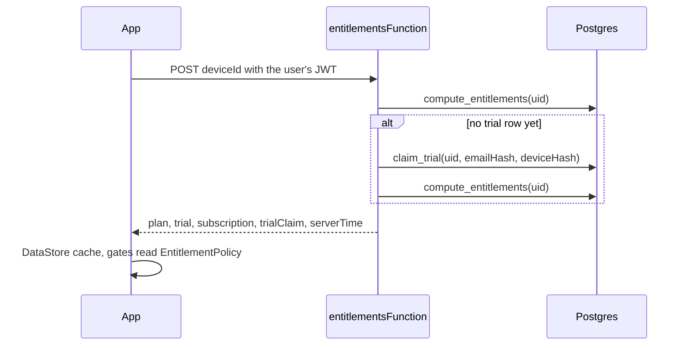

# Plans, trial and feature gates

> Status: Unreleased | Added in: next version after 3.1 | Last updated: 2026-10-08

## Summary

Every account is on Free, Trial or Pro (PRD v3.2 section 6.3, M2). The server decides the plan; the app caches it and locks BPM detection and Sing Along on Free, showing an upgrade sheet instead. New accounts get a one-time 30-day trial with everything in Pro, at most once per normalized email and per phone. Settings > Plans shows the plan, its dates and what each plan includes. Payments come in M4, so "Go Pro" is a disabled "Payments coming soon" button.

## Key files

Paths are relative to `app/src/main/java/com/autoomstudio/mp3studio/` unless they start with `supabase/`.

| File | Role |
|---|---|
| `data/plan/Entitlements.kt` | `Plan` (`Free`, `Trial`, `Pro`), `Feature` (`BpmDetector`, `SingAlong`, `UnlimitedSeparator`), `TrialClaim`, and the cached `Entitlements`. |
| `data/plan/EntitlementPolicy.kt` | Pure rules: `effectivePlan()`, `canUse()`, `isStale()`, `trialDaysLeft()`, `GRACE_MS` (7 days), `TRIAL_REMINDER_DAYS` (3). |
| `data/plan/EntitlementsBackend.kt` | `SupabaseEntitlementsBackend` calls the `entitlements` Edge Function; `EntitlementsResponse` maps its JSON. |
| `data/plan/EntitlementsCache.kt` | `DataStoreEntitlementsCache`, the last answer as JSON. |
| `data/plan/EntitlementsRepository.kt` | `entitlements: StateFlow`, `refresh(userId)`, `canUse(feature, userId)`, `clear()`. |
| `data/plan/DeviceId.kt` | SHA-256 of `ANDROID_ID` sent for the one-trial-per-phone check. |
| `data/tempo/TempoDetectionGate.kt` | `TempoSource` and the gate that lets cached tempos through and locks new detections. |
| `ui/plans/PlansViewModel.kt` | `PlanUiState` for screens, `canUse()`, manual `refresh()`, the "See plans" request. |
| `ui/plans/PlansScreen.kt` | Settings > Plans; `planLabel()` shared with the Account card. |
| `ui/plans/UpgradeSheet.kt` | The locked-feature sheet. |
| `supabase/functions/entitlements/`, `claim-trial/`, `_shared/` | Edge Functions; see [backend](../backend.md#edge-functions). |
| `supabase/migrations/20261008000000_plans.sql` | `compute_entitlements()` and `claim_trial()`. |

## How it works

### Server

- `compute_entitlements`: Pro when a `pro` subscription is `active`, or `cancelled` with `expires_at` in the future (and any `expires_at` not passed); else Trial while `trials.ends_at` is in the future; else Free.
- `claim_trial`: serialised per user with an advisory lock. Returns `existing` if the user has a trial row, `denied` (`account`) for a disabled profile, `denied` (`email` or `device`) when `trial_claims` already holds that hash, otherwise inserts the claim and a 30-day `trials` row and returns `granted`.
- The Edge Function takes the email from the verified token, normalizes it (lowercase, no `+alias`, Gmail dots removed, `googlemail.com` as `gmail.com`) and HMAC-SHA256s it and the device ID with `TRIAL_HASH_PEPPER`. Only hashes are stored.

### App

- Refresh: `AuthEffects` on sign-in, `AuthViewModel.verifyAccount()` on every foreground, and Refresh on the Plans screen (which also refreshes when opened). A failed call keeps the cache.
- `EntitlementPolicy.effectivePlan` uses the cached plan, but:
  - more than 7 days since the last successful check, or a phone clock more than an hour behind it, makes the cache stale and everything is Free until the next check (PL4);
  - trial and subscription end dates are compared with server time (`serverTime` plus time elapsed on the phone), so an ended trial locks offline.
- Gates:
  - Detect BPM (`MetronomeViewModel.detect` through `TempoDetectionGate`): a tempo cached in `song_tempos` still fills in on any plan; a new detection on Free fires `upgradeRequests` and `MetronomeSheet` shows the upgrade sheet. The button shows a lock icon on Free.
  - Sing Along chip on Now Playing: opens `SingAlongSheet` only when `SingAlong` is unlocked, otherwise the upgrade sheet; a lock icon shows on Free.
  - AI Vocal Separator is not limited yet (weekly limit in M3).
- "See plans" in the upgrade sheet sets `PlansViewModel.openPlansRequest`; Now Playing closes its sheets and `MainScreen` collapses the player and opens Settings > Plans.
- Account card: a Plan row ("Free trial, 23 days left", "Pro", "Free") that opens Plans.
- Trial banner (TR6): in the last 3 days of the trial, a dismissible banner above the main content opens Plans; dismissing hides it until the app process restarts.

## Data and persistence

- DataStore `entitlements`, key `entitlements_json`: the serialized `Entitlements` (user ID, plan, trial and subscription dates, trial claim, `serverTime`, `checkedAt`). Cleared on sign-out (PRD AU6). A cache for a different user ID unlocks nothing.
- Server tables `trials`, `trial_claims`, `subscriptions`: see [backend](../backend.md#tables). No Room changes.

## Manifest, permissions and notifications

None. Uses the existing `INTERNET` permission.

## Tests

- `data/plan/EntitlementPolicyTest.kt`: access table for Free, Trial and Pro, no cache, ended trial, expired subscription with and without a trial, 7-day grace boundary, clock turned back, server time deciding end dates, days-left rounding.
- `data/plan/EntitlementsRepositoryTest.kt`: refresh stores and maps the server answer, offline refresh keeps the cache, another account's cache unlocks nothing, clear, unknown plan values.
- `data/tempo/TempoDetectionGateTest.kt`: cached tempo on Free, locked new detection, detection with BPM Detector.
- `supabase/tests/plans_test.sql` (pgTAP, 16 checks): plan computation, claim idempotence, email and device reuse denied, disabled account, both functions not executable by `authenticated`.
- `supabase/functions/_shared/trial_test.ts` (Deno, 5 tests): email normalization, device ID validation, peppered hashing.
- Gaps: no UI tests for the upgrade sheet, Plans screen or banner; the Edge Functions' HTTP handling is only type-checked.

## Known limitations and TODOs

- Entitlements are not signed (SE8); a modified app can bypass the local gates (PRD residual risk).
- The device check trusts the `ANDROID_ID` hash the app sends; it changes after a factory reset and differs per Android user.
- Accounts created before M2 get their trial at their first refresh after the functions are deployed.
- The plan shown on screens is recomputed when the cache changes, not as time passes; the next foreground refresh catches up.
- Payments (M4), the separator weekly limit (M3) and admin plan changes (M5) are not built yet.

## Change history

| Date | Commit | Change |
|---|---|---|
| 2026-10-08 | - | Plans and gating (M2): entitlements functions, trial with abuse checks, cache with 7-day grace, BPM and Sing Along gates, upgrade sheet, Plans screen, Account plan row, trial banner. |
