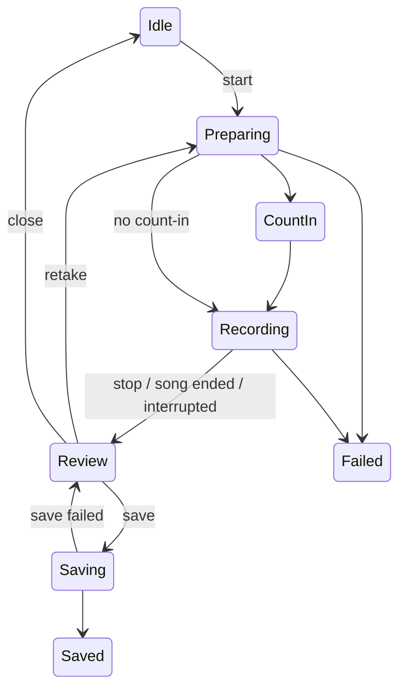

# Sing-along recording

> Status: Unreleased | Added in: next version after 3.1 | Last updated: 2026-10-07

## Summary

Sing-along records the user singing over a song's instrumental stem (the song must be separated first). MPlay plays the instrumental and records the voice in step with it. Afterwards the user can listen back, adjust voice level, music level and timing, and save a stereo M4A to `Music/MP3 Studio Recordings`, where it appears in the library. Everything stays on the phone, and the microphone is only used while recording. Requirement IDs SA1-SA18 refer to section 6.2 of `MPlay PRD v3.1.md`.

## Key files

Paths are relative to `app/src/main/java/com/autoomstudio/mplay/`.

| File | Role |
|---|---|
| `singalong/SingAlongSession.kt` | One-at-a-time session controller; `SingAlongState`, `FailReason`, `SingAlongOptions`. |
| `singalong/VoiceRecorder.kt` | `AudioRecord` capture to raw PCM, level meter, mic source and device choice. |
| `singalong/VoiceFile.kt` | Random-access reader for the raw take; silence outside the take. |
| `singalong/SingAlongMixer.kt` | `MixSettings`, alignment, mixing, soft limiter. |
| `singalong/TakeRenderer.kt` | `Take`, `EndReason`, streaming mix and AAC export. |
| `singalong/TakePreview.kt` | Live-adjustable preview through `AudioTrack`. |
| `singalong/RecordingStore.kt` | MediaStore save, space check, pending-row cleanup. |
| `singalong/RecordingNames.kt` | Name suggestion, sanitising, de-duplication. |
| `singalong/RecordingService.kt` | Microphone foreground service with Stop action. |
| `ui/singalong/SingAlongSheet.kt` | `SingAlongChip` and setup sheet. |
| `ui/singalong/SingAlongDevices.kt` | Mic permission state and audio routing (headphones, Bluetooth mic). |
| `ui/singalong/SingAlongOverlay.kt` | Full-screen dialog for all session states. |
| `ui/singalong/SingAlongAnimations.kt` | Overlay animations: `PulsingDot`, `VoiceRings`, `LiveWaveform`, `RollingTimer`, `SavingRing`, `SavedCheck`, `StaggeredIn`, `ShakeOnEnter`. |
| `ui/singalong/SingAlongViewModel.kt` | Session wrapper plus `singAlongNoteSeen`. |
| `app/src/main/res/drawable/ic_notification_mic.xml` | Notification icon. |

## How it works

### States

`Idle` > `Preparing` > `CountIn` > `Recording` > `Review` > `Saving` > `Saved`, or `Failed(reason)` at any point.

### Starting a take

1. Requires an instrumental stem (`stemRepository.stemUri(song.id, Instrumental)`), otherwise `Failed(NoStems)`. The sheet offers to separate first.
2. Starts `RecordingService`, connects its own `PlaybackController`, and waits up to 5 s for the song to be current.
3. Saves the current stem mode and lofi flag, pauses, turns lofi off, switches to `Instrumental`, waits until seekable and seeks to the start (song start or current position).
4. Optional 3-beat count-in (metronome BPM if running, else 1 s per beat).
5. Starts the recorder into `cacheDir/singalong/voice-<millis>.pcm`, then plays.
6. `leadFrames` = how much voice was captured before the music started, computed from timestamps.

### Ending a take

A 200 ms watcher ends the take on: recorder error, song change, repeat-one loop (position jumps back over 1.5 s), pause near the end (song ended), pause for about 400 ms (interrupted by call, focus loss, unplug or sleep timer), or Stop. Playback state is restored. Takes under 1 s fail as `TooShort`. Retake reuses the same start position.

### Capture

Mono 16-bit at 44.1 kHz, 1024-frame reads, on an urgent-audio thread. Sources tried in order: `UNPROCESSED` (if supported), `VOICE_RECOGNITION`, `MIC`. Preferred input: wired/USB headset mic, then built-in (never Bluetooth). Level meter maps -60 to 0 dB onto 0 to 1.

### Mixing and preview

- `MixSettings`: voice gain 1.0, instrumental gain 0.8 (both 0-1.5), offset 0 (±300 ms in 10 ms steps; positive delays the voice).
- Mono voice is added equally to both instrumental channels, then soft-limited (linear up to 0.8, `tanh` knee to a 0.99 ceiling).
- The mix length follows the voice.
- `TakePreview` streams the mix to a float stereo `AudioTrack` with about 100 ms buffer, re-reading settings every block so sliders apply live.

### Saving

- Renders on `Dispatchers.Default` to `cacheDir/singalong/mix-<millis>.m4a`: AAC-LC, 44.1 kHz stereo, 192 kbps (`AacFileWriter` from `:separation`).
- Android 10+: MediaStore insert into `Music/MP3 Studio Recordings/` with `IS_PENDING`, `IS_MUSIC = 1`, title and artist.
- Android 8-9: write `.<name>.partial`, rename, scan.
- Names: `"<title> - Sing along"`, sanitised, max 100 characters, `(2)`, `(3)` suffix on collision.
- Space check: `(seconds + 1) * (88,200 + 2 * 24,000) bytes + 20 MiB`; Start is disabled if short.

### Headphones and latency

The sheet warns when no headphones are connected (music will leak into the mic) and when only a Bluetooth mic is available. Recording is never blocked. There is no measured latency compensation beyond the timestamp-based lead; the Sync slider handles the rest.

### Animations

- Overlay states cross-fade with a slight scale (`AnimatedContent` keyed on the state class, so count-in ticks and progress updates don't re-trigger it).
- Recording: the "Recording" dot blinks; the timer digits roll; `LiveWaveform` scrolls the last 48 smoothed mic levels (red above `CLIP_LEVEL`) in place of the old level bar; `VoiceRings` expand from behind Stop with a halo that grows with the voice level.
- Saving: `SavingRing` shows the progress as a gradient arc with the percent inside and a bobbing mic above.
- Saved: `SavedCheck` springs in a circle, draws the check and fires a burst of dots; the message and Done button slide up after it. Failed shakes its icon once.
- With system animations off (`rememberAnimationsEnabled()`), the dot is solid, rings, rolling digits and burst are skipped, progress and the check show their final state, and states switch without a transition.

### Failure reasons

`Microphone`, `NoStems`, `Playback`, `TooShort`. Save errors return to Review with `saveFailed = true`.

## Data and persistence

- Temp: `cacheDir/singalong/` (`voice-*.pcm`, `mix-*.m4a`), cleaned on cancel/close/save and by `cleanUpLeftovers()` at startup (also removes abandoned pending MediaStore rows on Android 11+).
- Output: `Music/MP3 Studio Recordings/*.m4a` (exempt from the library's 30 s minimum).
- DataStore: `singalong_note_seen`. Mix settings and options are not persisted. No Room tables.

## Manifest, permissions and notifications

- `RECORD_AUDIO` (runtime), `FOREGROUND_SERVICE_MICROPHONE`, `<uses-feature android.hardware.microphone required="false">`.
- `singalong.RecordingService` (not exported, `foregroundServiceType="microphone"`; type 0 below Android 11).
- Channel `singalong`, ID 4301, Stop action `com.autoomstudio.mplay.singalong.STOP`, chronometer while recording.

## Tests

- `singalong/RecordingNamesTest.kt`: suggestion, sanitising, length, collision suffix.
- `singalong/SingAlongMixerTest.kt`: limiter, gains, centring, muting, offset, `VoiceFile` padding.
- No tests for the session, recorder, store, renderer, preview, service or UI (animations were checked by hand on an emulator).

## Known limitations and TODOs

- Latency is estimated, not measured; Bluetooth A2DP counts as headphones without a latency warning.
- Mid-song starts seek to the previous sync frame, so alignment may be slightly off.
- The count-in has no click unless the metronome is already running (SA6).
- The song must already be the player's current item.
- The foreground service stops after recording, so review and export run without one.
- On Android 8-9, saving needs `WRITE_EXTERNAL_STORAGE`, which this flow doesn't request.
- Pending-row cleanup only runs on Android 11+.

## Change history

| Date | Commit | Change |
|---|---|---|
| 2026-10-06 | `e13b2f7` | Sing-along recording added: session, recorder, mixer, preview, export, `RecordingService`, Now Playing chip and sheet, overlay. |
| 2026-10-06 | - | Recording and saving animations (`SingAlongAnimations.kt`): state transitions, blinking dot, voice rings, scrolling waveform, rolling timer, saving ring, animated saved check; off with system animations. |
| 2026-10-07 | - | Recordings folder renamed to `Music/MP3 Studio Recordings`; the old `Music/MPlay Recordings/` stays exempt from the 30 s minimum. A running session is cancelled on sign-out (`di/AuthEffects`). |
