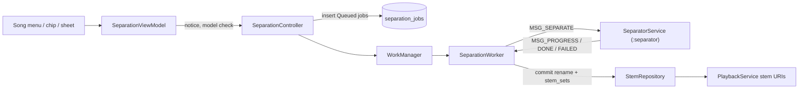

# AI vocal separation (stems)

> Status: Shipped | Added in: 3.0 | Last updated: 2026-10-07

## Summary

MPlay splits any local song into vocals and an instrumental entirely on the phone, offline, using the HT-Demucs model on ONNX Runtime. Songs are queued from the song menu, multi-select, the Now Playing chip or the sing-along sheet, and processed one at a time in the background with a notification and an on-screen progress pill. Once ready, Now Playing switches between Original, Instrumental and Vocals without losing position, and either stem can be exported to `Music/MP3 Studio Stems`.

## Key files

Paths are relative to `app/src/main/java/com/autoomstudio/mp3studio/` unless they start with `separation/` (the Gradle module).

| File | Role |
|---|---|
| `separation/ModelImporter.kt` | Imports a user-picked `.onnx` into `filesDir/models/`, verifying `BuildConfig.MODEL_SHA256`. |
| `separation/ModelProvider.kt` | `ModelState`, `BundledModelProvider`. |
| `separation/SeparationController.kt` | UI entry point: `enqueue`, `cancel`, `retry`; eligibility, model and storage checks; `start()` at launch; `onSignedIn()` resumes the queue, `onSignedOut()` stops it. |
| `separation/SeparationBackend.kt`, `WorkManagerSeparationBackend.kt` | Eligibility and unique `"separation"` WorkManager job (`schedule()`, `cancel()`). |
| `separation/SeparationRules.kt` | `DeviceEligibility`, `UnsupportedReason`, `StorageEstimate`. |
| `separation/SeparationEstimate.kt` | Rolling speed factor and "about N minutes" estimate. |
| `separation/SeparationLinks.kt` | `ACTION_OPEN_QUEUE` deep link. |
| `separation/worker/SeparationWorker.kt` | `CoroutineWorker`: queue loop, foreground notification, pauses, commit, failures. |
| `separation/worker/SeparatorService.kt` | Bound service in `:separator` that runs the model. |
| `separation/worker/SeparatorClient.kt`, `SeparatorProtocol.kt` | Messenger IPC client and message codes. |
| `separation/worker/ThermalMonitor.kt`, `DeviceConditions.kt` | Heat levels, charging and battery checks. |
| `separation/worker/SeparationNotifications.kt`, `CancelSeparationReceiver.kt` | Notifications and Cancel action. |
| `data/stems/StemEntities.kt`, `StemDao.kt` | `stem_sets`, `separation_jobs`, state enums. |
| `data/stems/StemRepository.kt` | Files on disk, queue, commit-by-rename, recovery, reconciliation, `stemUri()`. |
| `data/stems/StemExporter.kt` | Export to `Music/MP3 Studio Stems`. |
| `data/stems/StemMode.kt` | `Original`, `Instrumental`, `Vocals`. |
| `ui/separation/SeparationViewModel.kt` | UI state, notice and model-missing requests, export, import. |
| `ui/separation/SeparationScreen.kt` | Processing queue and ready list. |
| `ui/separation/SeparationProgressPill.kt` | Floating progress pill. |
| `ui/separation/SeparationTimeNotice.kt` | "May take a while" line and `SeparationNoticeDialog`. |
| `ui/separation/SeparationSettings.kt` | Settings section, `ModelMissingDialog`. |
| `ui/separation/SeparatorChip.kt` | Now Playing chip. |
| `separation/src/main/.../android/` | `OrtDemucsModel`, `ModelSource`, `MediaPcmSource` (optional `startUs`, `exactStart`, `maxFrames`), `AacStemSink`, `SeparateToFiles`. |
| `separation/src/main/.../pipeline/` | `StemSeparator`, `SegmentPlan`, `AdaptiveModel`, `HeatLevel`, `TrackStats`. |
| `separation/src/main/.../dsp/` | `DemucsSpectrogram`, `Fft`, `StereoResampler`, `ChannelMixer`. |

## How it works

### Requesting

`requestSeparation(songs)` shows `ModelMissingDialog` if no model is installed, then `SeparationNoticeDialog` (with a time estimate) unless "Don't show again" was ticked, then `controller.enqueue`. Enqueue checks eligibility (at least 5 GiB RAM, 64-bit ABI in `SEPARATION_ABIS`, not low-RAM, at least 1 GiB free), model presence and storage, and skips songs already done or active.

### Model

- Release builds bundle `models/htdemucs.onnx` (90.5 MB, fp16) as an uncompressed asset, memory-mapped from the APK.
- `ModelSource.find` prefers an imported `filesDir/models/htdemucs.onnx`.
- Import streams to `.part` while hashing, rejects files under 10 MB or with a wrong hash, then renames.

### Inference

- ONNX Runtime 1.22.0 on CPU, `ALL_OPT`, memory pattern and CPU arena disabled (peak memory per segment about 2.4 GB instead of 3.9 GB).
- STFT/iSTFT run in Kotlin outside the graph. Vocals = vocals source; instrumental = drums + bass + other.
- Pass 1 decodes the track for statistics (progress jumps to 5%). Pass 2 streams 343,980-sample segments (about 7.8 s at 44.1 kHz) with 25% overlap and triangular overlap-add, so memory stays bounded.
- Output: `vocals.m4a` and `instrumental.m4a`, AAC 192 kbps.

### Process isolation and IPC

`SeparatorService` runs in `:separator` so a native crash or OOM can't kill playback. Messenger messages: `MSG_SEPARATE` (1), `MSG_CANCEL` (2), `MSG_PROGRESS` (3), `MSG_DONE` (4), `MSG_FAILED` (5). One job at a time; the model stays loaded between songs. If the process dies mid-song the job fails as `OutOfMemory` and a fresh process is bound. `onDestroy` kills the process to free native memory.

### Worker

- Constraints from settings: requires charging, battery not low. Linear backoff 5 minutes. Policy `APPEND_OR_REPLACE` while running.
- Starts with `recoverInterrupted()` (requeue `Running` jobs, delete leftovers). Then, if `AuthRepository.awaitReady()` isn't `SignedIn`, it returns without touching the queue; it also re-checks `isSignedIn` before each song.
- Separation needs a signed-in user (PRD AU1). Queued work resumes from `di/AuthEffects` via `SeparationController.onSignedIn()` once the saved session is read, not from `start()`. On sign-out `onSignedOut()` cancels the unique work, so the running song goes back to `Queued` and waits for the next sign-in.
- Foreground type `MEDIA_PROCESSING` (API 35+) or `DATA_SYNC` (29-34). If Android 12+ refuses a background foreground start, jobs get `NeedsApp`.
- Output goes to `filesDir/stems/.work/<jobId>/`, then `commit()` atomically renames to `stems/<songId>/` and writes `stem_sets` + marks `Done` in one transaction. The measured speed is recorded for estimates.
- System stop reasons map to `TimeLimit`, `Charging`, `Battery` or `Interrupted` and requeue the job.

### Heat and battery

- `ThermalMonitor`: thermal status (API 29+), 10 s headroom forecast (API 35+), battery temperature below API 29.
- `AdaptiveModel` uses 4 threads when cool, 2 when warm or hotter; steps back up only after 120 s cool. At `Hot` it pauses between segments and reports cooling.
- Before each song (Hot limit) and every 15 s during a song (Critical limit), `DeviceConditions` may pause for heat (retry with backoff), charging or low battery (under 15%).

### Notifications

Channel `separation` (low importance). Progress ID 4101; finished / needs-app ID 4102. Shows percentage, time remaining or cooling, "N more songs waiting", and the time notice. Cancel goes through `CancelSeparationReceiver`, which marks the job cancelled; the worker sends `MSG_CANCEL`. Updates are throttled to once per second.

### Time estimate

`updatedFactor` = `prev * 0.7 + new * 0.3`, where a measurement is wall-clock seconds per song second. `minutes()` = `ceil(sum(durations) * factor / 60000)`, minimum 1, null without history.

### Playback integration

`StemMode` is session-wide (`stem_mode`), sent via `SET_STEM_MODE`. `PlaybackService.resolve()` points each item at the stem file if it exists. `refreshStemUris()` replaces the current item first, seeks back, then the rest, keeping shuffle order (latency logged under `StemSwitch`). Now Playing shows `StemModeSelector` for separated songs, otherwise `SeparatorChip`. Library rows show a badge. Stems are also used by [sing-along](sing-along.md) and [BPM detection](metronome.md).

### Reconciliation

`onLibraryChanged` waits 3 s, then re-attaches stems to a re-indexed song with the same size and fingerprint, or deletes stems whose source is gone or changed.

## Data and persistence

- Room: `stem_sets`, `separation_jobs` (see [database.md](../database.md)).
- Files: `filesDir/stems/<songId>/{vocals,instrumental}.m4a`, `filesDir/stems/.work/<jobId>/`, `filesDir/models/htdemucs.onnx`.
- Exports: `Music/MP3 Studio Stems/` (MediaStore on 10+, file copy + scan before).
- DataStore: `stem_mode`, `separation_charging_only`, `separation_pause_low_battery`, `separation_notice_hidden`, `separation_speed_factor`.
- BuildConfig: `MODEL_SHA256`, `SEPARATION_ABIS`.

## Manifest, permissions and notifications

- `FOREGROUND_SERVICE_DATA_SYNC`, `FOREGROUND_SERVICE_MEDIA_PROCESSING`, `POST_NOTIFICATIONS`, `WAKE_LOCK`, `WRITE_EXTERNAL_STORAGE` (max 29).
- `SystemForegroundService` merged with `dataSync|mediaProcessing`.
- `SeparatorService` (`:separator`, not exported), `CancelSeparationReceiver` (not exported).

## Tests

- App: `separation/SeparationEstimateTest.kt`, `separation/SeparationRulesTest.kt`, `separation/worker/HeatLevelsTest.kt`.
- `:separation` module: `dsp/` (FFT, spectrogram vs reference, resampler, mixer) and `pipeline/` (adaptive model, segment plan, separator, stats).
- No tests for the repository, DAO, worker, IPC, importer, exporter or UI.

## Known limitations and TODOs

- Interrupted jobs restart from the beginning (no per-segment resume).
- Cancel can lag by one segment because an ONNX call can't be interrupted.
- Any `:separator` death is reported as out of memory.
- Eligibility (including free storage) is computed once per app start.
- `NeedsApp` doesn't reschedule until the app opens again.
- No model download yet; the missing-model path only appears in debug builds without the model.
- CPU only (no XNNPACK/NNAPI execution provider).
- Exporting `Original` exports the instrumental.
- `files/stems` and `files/models` aren't excluded from backup rules.

## Change history

| Date | Commit | Change |
|---|---|---|
| 2026-10-05 | `55e39e6` | AI vocal separation added (version 3.0, Room schema v3). |
| 2026-10-05 | `bbed725` | Availability checks and notification titles. |
| 2026-10-05 | `967eb22` | `:separator` process service, model handling, build tasks. |
| 2026-10-05 | `0a56dcd` | Auto-sizing stem mode labels. |
| 2026-10-06 | `3c47315` | Thermal monitoring and adaptive thread count. |
| 2026-10-06 | `26863d9` | Model import improvements. |
| 2026-10-06 | `e13b2f7` | Time estimate (`SeparationEstimate`), notice before every separation with "Don't show again", time notice in notification, pill and queue. |
| 2026-10-06 | - | Simpler `separation_notice_message`: patience, processor and resources; dropped heat, quality and personal-use wording. |
| 2026-10-06 | - | `MediaPcmSource(exactStart = true)` drops decoded audio before `startUs` (by buffer presentation time), for the metronome's beat grid. Separation doesn't use it. |
| 2026-10-07 | - | Export folder renamed to `Music/MP3 Studio Stems`. The queue runs only while signed in (`onSignedIn`/`onSignedOut`, `SeparationBackend.cancel()`, worker auth check). See [accounts](accounts.md). |
